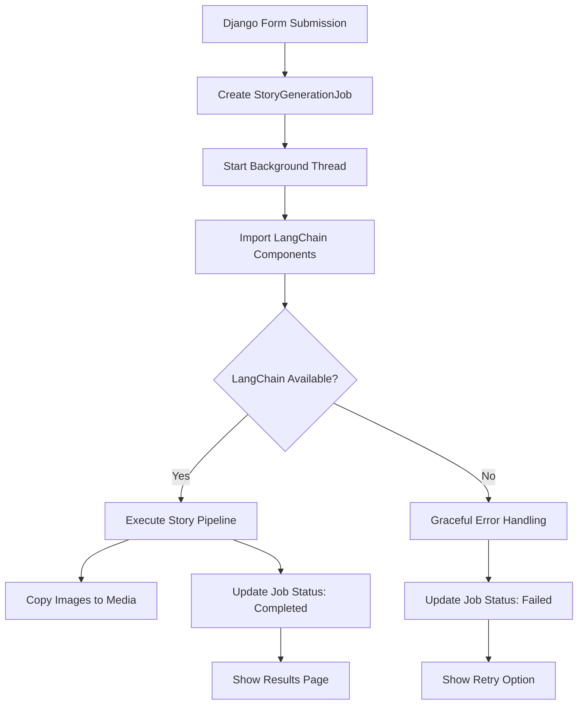

# StorySmith AI - Django Web Interface

🌐 **Professional Web Interface with Async LangChain Integration**

A Django web application that provides a seamless user interface for AI-powered story generation. Features asynchronous processing, real-time status updates, and complete integration with the LangChain-powered backend for creative storytelling.

## 📋 **Table of Contents**

- [Overview](#-overview)
- [Key Features](#-key-features)
  - [Asynchronous Processing](#-asynchronous-processing)
  - [Complete LangChain Integration](#-complete-langchain-integration)
  - [Robust Error Management](#️-robust-error-management)
  - [Professional User Experience](#-professional-user-experience)
- [Updated Project Structure](#-updated-project-structure)
- [Quick Start](#-quick-start)
  - [Prerequisites](#1-prerequisites)
  - [Installation & Setup](#2-installation--setup)
  - [Access the Application](#3-access-the-application)
  - [Testing Without LangChain](#4-testing-without-langchain)
- [LangChain Integration Architecture](#-langchain-integration-architecture)
  - [Integration Flow](#integration-flow)
  - [Key Integration Components](#key-integration-components)
- [Advanced Features](#️-advanced-features)
  - [Asynchronous Processing System](#asynchronous-processing-system)
  - [Error Handling & Recovery](#error-handling--recovery)
  - [Media File Management](#media-file-management)
- [URL Routing & User Flow](#-url-routing--user-flow)
  - [Complete URL Structure](#complete-url-structure)
  - [User Journey Flow](#user-journey-flow)
- [Testing & Development](#-testing--development)
  - [Testing Without GPU/LangChain](#testing-without-gpulangchain)
  - [Database Job Tracking](#database-job-tracking)
- [Performance & Scalability](#-performance--scalability)
  - [Current Implementation](#current-implementation)
  - [Production Considerations](#production-considerations)
- [Integration Testing Results](#-integration-testing-results)
  - [Successful Components](#-successful-components)
  - [Expected Behaviors (Without LangChain)](#-expected-behaviors-without-langchain)
  - [Production Ready Features](#-production-ready-features)

## 🎯 **Overview**

The Django app provides a production-ready web interface where users can:
- **Submit Story Prompts**: Enter text prompts with optional audio file uploads
- **Async Processing**: Background story generation with real-time status updates
- **Complete Visualizations**: View generated stories with character and background descriptions
- **Professional UI**: Auto-refreshing processing pages with progress indicators
- **Error Handling**: Graceful failure handling with retry options
- **Media Management**: Generated images stored and served through Django's media system

## ✨ **Key Features**

### 🔄 **Asynchronous Processing**
- Background threading for long-running AI operations (7-10 minutes)
- Real-time job status tracking with auto-refresh
- Non-blocking user experience with processing page

### 🎨 **Complete LangChain Integration**
- Direct integration with `langchain_app` pipeline
- Full story + character + background + image generation
- AI-powered background removal and image merging
- Graceful handling of missing packages/dependencies

### 🛡️ **Robust Error Management**
- Comprehensive error handling for missing LangChain packages
- User-friendly error messages with retry options
- Detailed logging for debugging and monitoring
- Circular import protection and fallback mechanisms

### 📱 **Professional User Experience**
- Auto-refreshing processing pages (30-second intervals)
- Progress indicators and timeline display
- Retry functionality with form pre-population
- Responsive design with Bootstrap integration

## 📁 **Updated Project Structure**

```
django_app/
├── manage.py                    # Django management script
├── db.sqlite3                   # SQLite database with job tracking
├── requirements.txt             # Django dependencies
├── storysmith.log              # Application logs
├── main/                       # Main Django application
│   ├── __init__.py
│   ├── admin.py                # Admin configuration
│   ├── apps.py                 # App configuration
│   ├── forms.py                # Form definitions
│   ├── models.py               # Database models (StoryGenerationJob)
│   ├── views.py                # View logic (async integration)
│   ├── urls.py                 # URL routing (processing, retry, status API)
│   ├── langchain_integration.py # 🆕 LangChain integration module
│   ├── tests.py                # Test cases
│   ├── migrations/             # Database migrations
│   │   └── 0001_initial.py     # 🆕 StoryGenerationJob model migration
│   └── templates/main/         # HTML templates
│       ├── base.html           # Base template
│       ├── input_form.html     # Story input form (with retry support)
│       ├── processing.html     # 🆕 Processing page with auto-refresh
│       └── result.html         # Story results display (enhanced)
├── media/                      # Media files
│   ├── audio_uploads/          # Uploaded audio files
│   └── storysmith/             # 🆕 Generated story images
│       ├── final_image_*.jpg   # Complete story visualizations
│       ├── character_*.jpg     # Character images
│       └── background_*.jpg    # Background images
├── static/                     # Static files (CSS, JS, images)
└── storysmith/                 # Django project settings
    ├── __init__.py
    ├── asgi.py                 # ASGI configuration
    ├── settings.py             # Project settings
    ├── urls.py                 # Main URL configuration
    └── wsgi.py                 # WSGI configuration
```

## 🚀 **Quick Start**

### 1. **Prerequisites**
- Python 3.8+
- Django 4.2+
- Access to LangChain app directory (optional for full functionality)
### 2. **Installation & Setup**

```bash
# Navigate to Django app directory
cd django_app

# Install Django dependencies
pip install -r requirements.txt

# Create and apply database migrations
python manage.py makemigrations main
python manage.py migrate

# Create superuser (optional, for admin access)
python manage.py createsuperuser

# Start development server
python manage.py runserver
```

### 3. **Access the Application**

- **Web Interface**: http://127.0.0.1:8000/
- **Admin Panel**: http://127.0.0.1:8000/admin/ (if superuser created)

### 4. **Testing Without LangChain**

The Django app is designed to work gracefully even without LangChain packages installed:

1. **Submit a story prompt** through the web form
2. **Processing page** will show with auto-refresh
3. **Expected failure** due to missing LangChain packages
4. **Retry functionality** allows testing the complete workflow
5. **Error messages** are user-friendly and informative

## 🔗 **LangChain Integration Architecture**

### **Integration Flow**



### **Key Integration Components**

#### 1. **StoryGenerationJob Model** (`models.py`)
```python
class StoryGenerationJob(models.Model):
    job_id = models.UUIDField(default=uuid.uuid4, unique=True)
    text_prompt = models.TextField()
    status = models.CharField(max_length=20, choices=STATUS_CHOICES)
    story_text = models.TextField(blank=True, null=True)
    character_description = models.TextField(blank=True, null=True)
    background_description = models.TextField(blank=True, null=True)
    final_image_path = models.CharField(max_length=500, blank=True)
    # ... additional fields for complete tracking
```

#### 2. **LangChain Integration Module** (`langchain_integration.py`)
```python
def start_story_generation_async(text_prompt, audio_filename=None):
    """Start asynchronous story generation with threading"""
    
def process_story_generation(job_id):
    """Background processing with comprehensive error handling"""
    
def import_langchain_components():
    """Import with fallback to mock components for testing"""
```

#### 3. **Async View Architecture** (`views.py`)
```python
def home_view(request):
    """Form submission → Create job → Redirect to processing"""
    
def processing_view(request, job_id):
    """Auto-refreshing status page with progress indicators"""
    
def result_view(request, job_id):
    """Display complete results with images and retry options"""
    
def job_status_api(request, job_id):
    """JSON API for AJAX status checking"""
```

## 🛠️ **Advanced Features**

### **Asynchronous Processing System**

#### **Background Threading**
```python
# Non-blocking story generation
thread = threading.Thread(
    target=process_story_generation,
    args=(job.job_id,),
    daemon=True
)
thread.start()
```

#### **Real-time Status Updates**
```javascript
// Auto-refresh every 30 seconds
setInterval(function() {
    fetch('/api/job-status/' + jobId + '/')
        .then(response => response.json())
        .then(data => {
            if (data.status === 'completed') {
                window.location.href = '/result/' + jobId + '/';
            }
        });
}, 30000);
```

### **Error Handling & Recovery**

#### **Missing Package Handling**
```python
try:
    from chains.story_chain import create_enhanced_story_chain
    return create_enhanced_story_chain, StorySmithError, log_error, log_info
except ImportError as e:
    # Return mock components for graceful degradation
    return mock_create_enhanced_story_chain, MockStorySmithError, mock_log_error, mock_log_info
```

#### **User-Friendly Error Messages**
- **Missing Packages**: "LangChain components not available - packages not installed"
- **Circular Imports**: Clear indication of import issues
- **Processing Failures**: Specific error context with retry options

### **Media File Management**

#### **Generated Image Storage**
```python
def copy_generated_files_to_media(job_id, langchain_result):
    """Copy images from langchain_app/outputs to Django media directory"""
    # Organized file structure: media/storysmith/final_image_{job_id}.jpg
    # Automatic cleanup and path management
    # Integration with Django's static file serving
```

## 🎯 **URL Routing & User Flow**

### **Complete URL Structure**
```python
urlpatterns = [
    path('', views.home_view, name='home'),                                    # Form submission
    path('processing/<uuid:job_id>/', views.processing_view, name='processing'), # Status page
    path('result/<uuid:job_id>/', views.result_view, name='result'),             # Results display
    path('retry/<uuid:job_id>/', views.retry_view, name='retry'),                # Retry with modifications
    path('api/job-status/<uuid:job_id>/', views.job_status_api, name='job_status_api'), # AJAX API
]
```

### **User Journey Flow**
1. **Form Submission** (`/`) → Creates job, redirects to processing
2. **Processing Page** (`/processing/{job_id}/`) → Auto-refreshing status
3. **Results Page** (`/result/{job_id}/`) → Complete story visualization
4. **Retry Flow** (`/retry/{job_id}/`) → Pre-populated form for modifications

## 🧪 **Testing & Development**

### **Testing Without GPU/LangChain**

The application is designed for complete testing without LangChain packages:

```bash
# 1. Start Django server
python manage.py runserver

# 2. Submit story prompt via web interface
# Expected flow:
# - Form submission succeeds
# - Processing page displays
# - Background thread starts
# - Import fails gracefully
# - Error status with retry option
```

### **Database Job Tracking**

View job status through Django admin or shell:
```python
python manage.py shell
>>> from main.models import StoryGenerationJob
>>> jobs = StoryGenerationJob.objects.all()
>>> for job in jobs:
...     print(f"Job {job.job_id}: {job.status} - {job.text_prompt[:50]}")
```

## 📊 **Performance & Scalability**

### **Current Implementation**
- **Threading**: Background processing for non-blocking user experience
- **Session Storage**: Job tracking through database models
- **Media Management**: Efficient file storage and serving
- **Auto-refresh**: 30-second intervals with fallback mechanisms

### **Production Considerations**
- **Celery Integration**: Ready for async task queue implementation
- **Redis/Database**: Scalable job tracking and caching
- **Load Balancing**: Stateless design supports multiple server instances
- **Error Monitoring**: Comprehensive logging for production debugging

## 🔍 **Integration Testing Results**

### ✅ **Successful Components**
- **Form Handling**: Complete form validation and submission
- **Async Processing**: Background threading with job tracking
- **Error Recovery**: Graceful handling of missing dependencies
- **User Experience**: Auto-refreshing pages with progress indicators
- **Media Management**: File storage and serving integration

### 🔄 **Expected Behaviors (Without LangChain)**
1. **Job Creation**: ✅ Database record created successfully
2. **Processing Start**: ✅ Background thread initiates
3. **Import Failure**: ✅ Graceful error handling
4. **Status Update**: ✅ Job marked as failed with clear message
5. **Retry Option**: ✅ User can modify and resubmit

### 🚀 **Production Ready Features**
- **Database Migrations**: Complete schema management
- **Error Logging**: Detailed debugging information
- **User Feedback**: Professional error messages and retry flows
- **Media Handling**: Production-ready file management
- **Security**: CSRF protection and input validation

# Create superuser (optional, for admin access)
python manage.py createsuperuser

# Start development server
python manage.py runserver
```

### 3. **Access the Application**

- **Web Interface**: http://127.0.0.1:8000/
- **Admin Panel**: http://127.0.0.1:8000/admin/ (if superuser created)

## 🔗 **LangChain Integration**

### **How Django Connects to LangChain**

The Django app integrates with the LangChain backend through direct Python imports:

```python
# In views.py
import sys
import os

# Add LangChain app to Python path
sys.path.append(os.path.join(os.path.dirname(__file__), '..', '..', 'langchain_app'))

# Import LangChain components
from chains.composite_chain import create_story_visualization_chain
from utils.error_handler import log_error, StorySmithError
```

### **Using Chains in Django Views**

```python
def generate_story_view(request):
    """
    Main view for story generation using LangChain backend.
    """
    if request.method == 'POST':
        form = StoryInputForm(request.POST, request.FILES)
        
        if form.is_valid():
            try:
                # Get user input
                topic = form.cleaned_data['text_prompt']
                
                # Create LangChain chain
                chain = create_story_visualization_chain()
                
                # Execute story generation
                result = chain.invoke({"topic": topic})
                
                # Return results to template
                return render(request, 'main/result.html', {
                    'result': result,
                    'topic': topic,
                    'success': True
                })
                
            except StorySmithError as e:
                # Handle LangChain-specific errors
                return render(request, 'main/input_form.html', {
                    'form': form,
                    'error': f"Story generation failed: {e}",
                    'error_type': 'langchain'
                })
                
z            except Exception as e:
                # Handle general errors
                log_error(f"Unexpected error in Django view: {e}")
                return render(request, 'main/input_form.html', {
                    'form': form,
                    'error': "An unexpected error occurred. Please try again.",
                    'error_type': 'general'
                })
    else:
        form = StoryInputForm()
    
    return render(request, 'main/input_form.html', {'form': form})
```

### **Configuration Sharing**

Both Django and LangChain apps share the same configuration:

```python
# Configuration is shared through:
# 1. Environment variables (.env files)
# 2. Python path manipulation
# 3. Direct imports

# Example in Django settings.py
import os
from dotenv import load_dotenv

# Load environment variables (same as LangChain app)
load_dotenv(os.path.join(BASE_DIR, '..', 'langchain_app', '.env'))

# Access shared configuration
GOOGLE_API_KEY = os.getenv('GOOGLE_API_KEY')
HUGGINGFACE_API_TOKEN = os.getenv('HUGGINGFACE_API_TOKEN')
```

### **Error Handling for LangChain Operations**

```python
from utils.error_handler import StorySmithError, log_error

def handle_langchain_errors(request, form):
    """
    Centralized error handling for LangChain operations.
    """
    try:
        # LangChain operation
        result = chain.invoke({"topic": topic})
        return result
        
    except StorySmithError as e:
        # Log the error
        log_error(f"LangChain error: {e}")
        
        # User-friendly error messages
        error_messages = {
            'API_ERROR': 'Service temporarily unavailable. Please try again.',
            'VALIDATION_ERROR': 'Invalid input. Please check your prompt.',
            'GENERATION_ERROR': 'Story generation failed. Please try a different prompt.',
        }
        
        error_type = getattr(e, 'error_type', 'GENERAL')
        user_message = error_messages.get(error_type, str(e))
        
        return render(request, 'main/input_form.html', {
            'form': form,
            'error': user_message,
            'show_retry': True
        })
```

## 📝 **Web Forms & User Input**

### **Story Input Form**

The main form (`StoryInputForm`) handles:

```python
class StoryInputForm(forms.Form):
    # Text prompt (required, max 300 characters)
    text_prompt = forms.CharField(
        max_length=300,
        required=True,
        widget=forms.Textarea(attrs={
            'class': 'form-control',
            'placeholder': 'Enter your story prompt here...',
            'rows': 4,
            'maxlength': 300
        })
    )
    
    # Audio file upload (optional, max 10MB)
    audio_file = forms.FileField(
        required=False,
        widget=forms.FileInput(attrs={
            'accept': 'audio/*'
        })
    )
```

### **Form Validation**

- **Text Prompt**: Required, max 300 characters, whitespace validation
- **Audio File**: Optional, max 10MB, audio format validation
- **Security**: File type validation, size limits, XSS protection

### **User Experience Features**

- Character count display for text prompts
- Audio file preview and validation
- Real-time form validation
- Progress indicators during story generation
- Error messages with retry options

## 🎨 **Templates & UI**

### **Template Structure**

```html
<!-- base.html - Common layout -->
<!DOCTYPE html>
<html>
<head>
    <title>StorySmith AI</title>
    <!-- Bootstrap, custom CSS -->
</head>
<body>
    <nav><!-- Navigation --></nav>
    <main>
        
    </main>
    <footer><!-- Footer --></footer>
</body>
</html>

<!-- input_form.html - Story input form -->


    <form method="post" enctype="multipart/form-data">
        {{ form.as_p }}
        <button type="submit">Generate Story</button>
    </form>


<!-- result.html - Story results display -->


    <div class="story-result">
        <h2>Generated Story</h2>
        <div class="story-content">{{ result.story }}</div>
        <div class="character-description">{{ result.character_description }}</div>
        <div class="background-description">{{ result.background_description }}</div>
    </div>

```

### **Responsive Design**

- Bootstrap-based responsive layout
- Mobile-friendly form inputs
- Touch-friendly audio upload interface
- Progressive enhancement for JavaScript features

## 🔧 **Development Workflow**

### **Local Development Setup**

```bash
# 1. Set up Django app
cd django_app
python manage.py migrate
python manage.py runserver

# 2. Ensure LangChain app is configured
cd ../langchain_app
# Make sure .env file has required API keys

# 3. Test integration
# Visit http://127.0.0.1:8000/ and test story generation
```

### **Environment Variables**

Required environment variables (shared with LangChain app):

```bash
# In langchain_app/.env (shared configuration)
GOOGLE_API_KEY=your_google_api_key_here
HUGGINGFACE_API_TOKEN=your_huggingface_token_here
OUTPUT_DIR=./outputs
TEMP_DIR=./temp
LOG_FILE=storysmith.log
```

### **Testing the Integration**

```bash
# Test Django app
python manage.py test

# Test LangChain integration manually
python manage.py shell
>>> from main.views import generate_story_view
>>> # Test view logic
```

## 🚨 **Error Handling & Debugging**

### **Common Issues**

1. **LangChain Import Errors**
   ```python
   # Fix: Ensure Python path includes langchain_app
   sys.path.append(os.path.join(os.path.dirname(__file__), '..', '..', 'langchain_app'))
   ```

2. **API Key Errors**
   ```python
   # Fix: Check environment variable loading
   from dotenv import load_dotenv
   load_dotenv('../langchain_app/.env')
   ```

3. **File Upload Issues**
   ```python
   # Fix: Check media settings in settings.py
   MEDIA_URL = '/media/'
   MEDIA_ROOT = os.path.join(BASE_DIR, 'media')
   ```

### **Logging & Monitoring**

```python
# Django logging configuration
LOGGING = {
    'version': 1,
    'disable_existing_loggers': False,
    'handlers': {
        'file': {
            'level': 'INFO',
            'class': 'logging.FileHandler',
            'filename': 'storysmith.log',
        },
    },
    'root': {
        'handlers': ['file'],
    },
}
```

## 🔄 **Data Flow**

```
User Input (Web Form)
    ↓
Django Form Validation
    ↓
Django View Processing
    ↓
LangChain Chain Invocation
    ↓
Story Generation (Google Gemini API)
    ↓
Image Prompt Generation
    ↓
Result Processing
    ↓
Template Rendering
    ↓
HTML Response to User
```

## 🛡️ **Security Considerations**

- **CSRF Protection**: Django CSRF tokens on all forms
- **File Upload Security**: File type and size validation
- **Input Sanitization**: Form validation and cleaning
- **API Key Security**: Environment variables, never in code
- **Error Handling**: No sensitive data in error messages

## 📚 **Next Steps**

For more detailed information about the AI backend:
- See `../langchain_app/README.md` for LangChain implementation details
- Check `../langchain_app/` for configuration options
- Review error handling patterns in `utils/error_handler.py`

This Django app provides a robust web interface for the StorySmith AI system, focusing on user experience while seamlessly integrating with the powerful LangChain backend for story generation.
